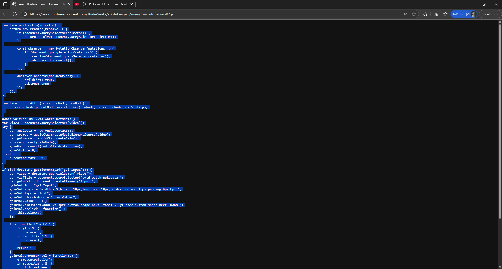
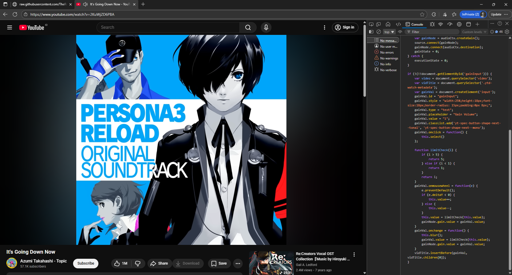
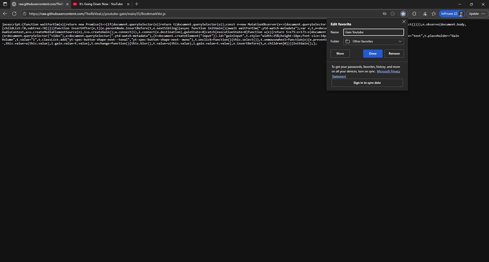
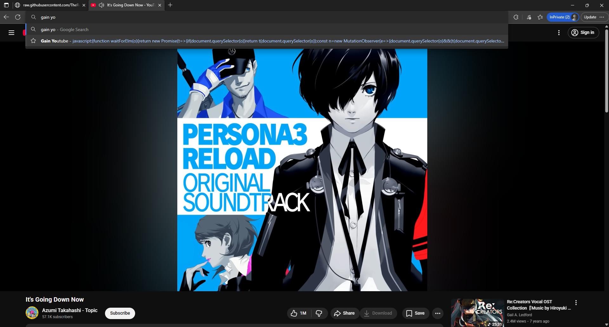
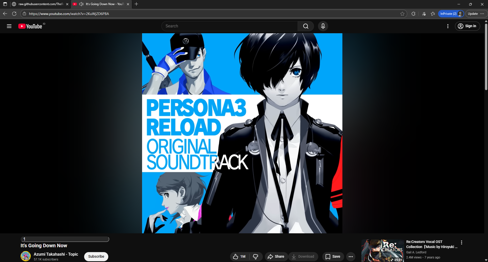

# youtube-gain
Simple youtube audio gain via console.

You can copy the code from [>>>>>>HERE<<<<<<](https://raw.githubusercontent.com/TheReVeaLz/youtube-gain/main/JS/youtubeGainV2.js)

How to use the code with console

Copy the code

Play videos that you want, after that press F12 (If there's confirmation option just click yes) and find Console tab from there.

Paste the code and press enter.

Below the video you should be able to see number for volume gain (1 = 100%, 2 = 200%, etc).
You can change the gain by typing in it or scroll inside number box.

You can copy the code from [>>>>>>HERE<<<<<<](https://raw.githubusercontent.com/TheReVeaLz/youtube-gain/main/JS/BookmarkVer.js)

How to use the code with bookmark

Make new bookmark on any site

Edit the bookmark URL with javascript code.

Open the boorkmark on youtube sites.

Below the video you should be able to see number for volume gain (1 = 100%, 2 = 200%, etc).
You can change the gain by typing in it or scroll inside number box.

